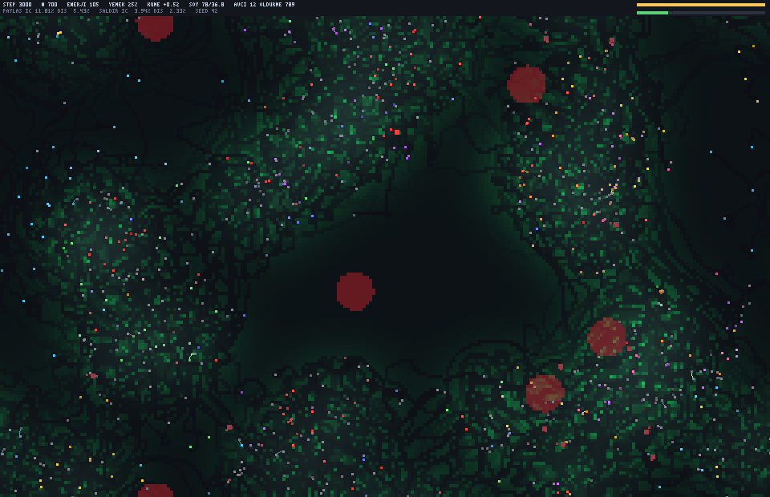

# Faz 4 adım 1 — doğal avcı: düşmanlık mı, sürü mü, hiçbiri mi?

Ortak, dışsal ve **gruptan bağımsız** bir tehdit ekledik. Literatürde parochial
düşmanlığın tetikleyicisi olarak geçen baskı budur; Faz 3 adım 2'de düşmanlık
çıkmamasının gerekçesi de "böyle bir baskı yok" idi.

Tasarım: **2×2**, her hücre 12000 adım, Faz 2 tohumuyla (`docs/faz2/population.npz`).

| | gerçek etiket | karıştırma kontrolü |
|---|---|---|
| **avcı var** | `faz4_avci` | `faz4_avci_kontrol` |
| **avcı yok** | `faz4_avcisiz` | `faz4_avcisiz_kontrol` |

Ayrımcılık sıfıra karşı değil, **kendi eşleşmiş kontrolüne** karşı okunur; iki
kolun `t` değeri ancak ondan sonra kıyaslanır. Kollar arasındaki tek fark
`rules.predator.enabled`'dır (`tests/test_tools.py::TestPredatorArms` bunu sabitler).

Avcı **soyisme bakmaz** — hedefini yalnızca mesafeye göre seçer
(`sinek/predator.py::_nearest`, `test_predator_target_is_group_blind`).
"Avcı gelince gruplaş" ya da "yabancıya saldır" diye bir kural **yok**;
avcı başına adımda tek vuruş + bekleme süresi vardır, dolayısıyla kalabalıkta
kişi başı risk kendiliğinden düşer (seyreltme / selfish herd). Sürüleşme
çıkarsa **çıkar**, kodlanmaz.

*Soya göre renklenmiş sinekler; avcılar küçük parlak kırmızı işaretler
(bekleme süresindeyken sönük), büyük koyu bordo diskler ise `world.hazard`
sabit tehlikeleri. HUD son satırı avcı sayısını ve toplam öldürmeyi yazar.*

---

## 0. Birinci parti okunamadı — ve nedeni bir ders

İlk koşumlar config varsayılanıyla (20 avcı) yapıldı. Bu ayar **1500 adımda**
kalibre edilmişti: ölümlerin ~%23'ü avcıya bağlanıyor, koloni tavanda
duruyordu. 12000 adımda iki şey birden bozuldu:

- **Karıştırma kontrolü 9873. adımda tükendi** (700 → 0, birkaç yüz adımda).
  Eşleşmiş kontrolü ölmüş bir koldan ayrımcılık okunamaz.
- **Dış-grup fırsat payı %2.7'ye düştü** (etkin soy 11.4 → 1.3). Koloni tek
  soya indiğinde "in-grup / dış-grup" farkı ölçülecek örneklem kalmıyor.

Ölüm öncesi kontrolün profili şu: kümelenme 0.997, işbirliği oranı %94,
yemek doluluğu %99.9. Yani koloni tek bir yumağa toplanıp **yiyecek toplamayı
bırakmış**, enerjiyi aralarında dolaştırmış ve topluca açlıktan ölmüştü.
Paylaşımın net maliyeti olduğu için bu yol tek yönlüdür.

**Ders:** kalibrasyonu deneyin koşacağı **tam ufukta** yapın. Kısa kalibrasyon
burada yalnızca eksik değil, yanıltıcıydı.

Yeniden kalibrasyon, sonucu görmeden ilan edilmiş üç ölçütle yapıldı — bunları
birden sağlayan **en güçlü** baskı seçilir:

1. hem asıl kol hem karıştırma kontrolü 12000 adım yaşar,
2. son çeyrekte dış-grup fırsat payı ≥ %10 (yoksa in/out oranı gürültüdür),
3. ölümlerin ≥ %10'u avcıya bağlanır (yoksa seçilim baskısı yoktur).

| avcı sayısı | kontrol yaşadı mı | dış-grup payı | avcıya bağlı ölüm | ölçüt |
|---|---|---|---|---|
| 8 | evet | **%8.2** | %11.5 | (2) düştü |
| **12** | evet | %22.8 | %16.8 | **geçti** |
| 20 | **hayır (tükendi)** | %2.7 | %24.7 | (1) ve (2) düştü |

`config.yaml` varsayılanı 20 → **12** oldu. Aşağıdaki tüm sonuçlar 12 avcıyla.

---

## 1. Üç soru, üç seed (42, 7, 123)

Her seed için dört koşum; `atk_t` ve `share_t` her kolun **kendi** karıştırma
kontrolüne karşı. Negatif `atk_t` = saldırı yabancıya yöneliyor.

| seed | kol | `kin_bias_adj` (kontrol) | `share_t` | `atk_t` | karar |
|---|---|---|---|---|---|
| 42 | avcı | +15.09 (+0.23) | **+2.32** | −1.42 | kör |
| 42 | avcısız | +3.93 (+0.86) | **+6.96** | **−10.43** | yabancıya |
| 7 | avcı | −2.91 (−0.28) | −0.89 | −0.52 | kör |
| 7 | avcısız | +41.58 (−0.48) | **+12.19** | **−8.46** | yabancıya |
| 123 | avcı | +15.96 (+1.95) | **+11.94** | **−8.72** | yabancıya |
| 123 | avcısız | +9.89 (−1.04) | **+2.91** | +2.34 | akrabaya |

### S1 — Avcı dış-grup düşmanlığı üretiyor mu? **HAYIR.**

`atk_t` ortalaması avcılı kolda **−3.55**, avcısız kolda **−5.52**. Yani avcı
altında saldırı yabancıya *daha az* yöneliyor. Kararlar: avcılı {yabancıya 1,
kör 2}, avcısız {yabancıya 2, akrabaya 1} — tutarlı bir kayma yok.

Saldırı **seviyesi** de artmıyor: son çeyrekte %0.77 / %5.14 / %1.82 (avcılı)
karşısında %2.36 / %3.17 / %2.05 (avcısız). 3 seed'in yalnızca birinde (7)
saldırı arttı ve orada da akrabalığa **kör** kaldı (D/Ç sınıflandırıcısı: Ç —
ayrım gütmeyen bir artış, düşmanlık değil).

Yan bulgu: **Faz 3 adım 2'nin "saldırı akrabalığa kör" sonucu seed 42'de artık
tekrarlanmıyor.** Sensör sözleşmesi 16 → 19'a çıkınca (rastgelelik akışı
kayıyor, üç sütun sıfırla ekleniyor) aynı seed'in avcısız kolu `atk_t = −10.43`
veriyor. Eksen A'nın uyarısı bir kez daha doğrulandı: o negatif, kurulumun
değil o koşumun özelliğiymiş.

### S2 — Avcı in-grup işbirliğini güçlendiriyor mu? **Hayır; onun yerine ayrımı SİLİYOR.**

`share_t` avcılı kolda ortalama **+4.46**, avcısız kolda **+7.35**. Yani
akrabalık ayrımcılığı avcı altında *zayıflıyor*.

Seed 42'de son çeyrek dört hücresi bunu çıplak gösteriyor:

| | avcı: in | avcı: dış | avcısız: in | avcısız: dış |
|---|---|---|---|---|
| PAYLAŞ | %97.05 | **%97.80** | %6.93 | %2.64 |
| SALDIR | %0.84 | %0.56 | %1.49 | %3.00 |

Paylaşım patlıyor (%7 → %97) ama **in ile dış eşit**. Ve aynı patlama
etiketlerin bilgisiz olduğu karıştırma kontrolünde de var (%2.6 → %53.5):
demek ki artışı süren akrabalık değil, **yoğunluk** — avcı altında herkes
sürekli birinin menzilinde ve o biri sürekli aç.

Nedensel sonda (`kin_sonda.txt`, ajanları hiç çalıştırmadan yalnızca akrabalık
kanalını çeviriyor) aynı yöne işaret ediyor: paylaşım farkı avcılı kolda
**+0.0087** (%59.1 akrabayı kayırıyor), avcısız kolda **+0.0548** (%65.9).
Beyin avcı altında akrabalık kanalını daha *az* okuyor.

Sürüleşmeye gelince: kümelenme 3/3 seed'de arttı (0.474→0.989, 0.965→0.993,
0.452→0.490) ama iki seed'de artış ihmal edilebilir. Seyreltme etkisi çalışıyor
gibi duruyor, ama tek başına bu üç nokta kanıt değil.

### S3 — Fedakârlık ile düşmanlık avcı altında BİRLİKTE mi geliyor? **Hayır.**

Dönem-dönem `coop_in_group` × `attack_out_group` Pearson r'si: avcılı kolda
**−0.24**, avcısız kolda **+0.01**. Üç seed'de sırasıyla +0.48 / −0.60 / −0.61
— işareti bile oturmuyor. Üstelik **karıştırma kontrolünde de** benzer
değerler çıkıyor (+0.48 / +0.16 / −0.18), yani bu r yapısal bir eşzamanlılığı
değil ortak eğilimi ölçüyor olabilir. Faz 3'te ayrılabilen iki davranışı avcı
bağlamıyor.

---

## 2. Avcı ne yaptı? (kaldıracın yan etkileri)

Yorum yapmadan önce kaldıracın gerçekte ne oynattığını ölçmek zorundayız.

| büyüklük (son çeyrek) | seed 42 | seed 7 | seed 123 |
|---|---|---|---|
| kümelenme | 0.474 → **0.989** | 0.965 → 0.993 | 0.452 → 0.490 |
| etkin soy | 9.53 → **2.81** | 7.43 → **2.41** | 3.60 → 4.06 |
| dış-grup fırsat payı | %57.9 → **%22.8** | %18.7 → **%11.4** | %27.1 → %43.4 |
| yemek doluluğu | 0.239 → **0.883** | 0.486 → 0.801 | 0.310 → 0.269 |
| `kin_assortment` | 0.286 → 0.582 | 0.712 → 0.706 | 0.685 → 0.308 |

Avcı yalnızca bir tehdit eklemiyor: kümelenmeyi, soy çeşitliliğini, yemek
tüketimini ve akrabalık yapısını birlikte kaydırıyor. Bunlardan ikisi ölçümün
kendisine zarar veriyor — etkin soy düşünce dış-grup örneklemi küçülüyor.
Seed 42'nin `kin_bias_adj` eğrisi bunu resmediyor
([adim1_karsilastirma.png](adim1_karsilastirma.png)): 12–14. dönemlerde +0.71'e
kadar çıkıyor, sonra dış-grup örneklemi eridikçe 0'a iniyor.

---

## 3. Asıl gürültü kaynağı: koloni **iki kararlı rejim** arasında gidip geliyor

Üçüncü seed'i koşarken ortaya çıktı. On iki koşumun her biri son çeyrekte
ikisinden birine düşüyor:

- **seyrek toplayıcı**: işbirliği < %20, yemek doluluğu ~0.25, dağınık;
- **yoğun paylaşım yumağı**: işbirliği > %50, doluluk 0.44–0.88, toplayıcılık
  düşük.

| seed | avcı | avcı kontrol | avcısız | avcısız kontrol |
|---|---|---|---|---|
| 42 | yumak (%97.2) | yumak (%53.5) | seyrek (%4.4) | seyrek (%2.6) |
| 7 | yumak (%91.2) | yumak (%85.1) | yumak (%59.4) | yumak (%68.2) |
| 123 | seyrek (%16.7) | yumak (%80.7) | yumak (%85.9) | yumak (%41.1) |

Yumak rejimi **avcıya özgü değil**: avcısız kollarda ve etiketin bilgisiz
olduğu kontrollerde de çıkıyor. Yani koşumlar arasındaki en büyük fark avcı
değil, koşumun hangi havzaya düştüğü. `share_t` 12.19 ile −0.89 arasında
salınırken, bu salınımın büyük kısmını açıklayan şey bu.

20 avcılı partide kontrolün tükenmesi de aynı rejimin uç hâliydi: yumak
kapanıp toplayıcılık tamamen durunca koloni topluca açlıktan ölüyor.

---

## 4. Ne diyebiliriz, ne diyemeyiz

**Diyebiliriz:**
- Ortak, gruptan bağımsız bir avcı, bu kurulumda **dış-grup düşmanlığı
  üretmiyor** — ne saldırının seviyesini ne de yönünü tutarlı biçimde
  yabancıya kaydırıyor (3/3 seed).
- Avcı in-grup ayrımcılığını **güçlendirmiyor**; paylaşımı patlatıyor ama
  **ayrım gözetmeyen** bir paylaşıma dönüştürüyor. Karıştırma kontrolündeki
  aynı patlama ve nedensel sonda, bunun akrabalık değil yoğunluk etkisi
  olduğunu söylüyor.
- Fedakârlık ile düşmanlık avcı altında **birbirine bağlanmıyor**.
- Faz 3 adım 2'nin seed 42'deki "saldırı akrabalığa kör" bulgusu, sensör
  sözleşmesi büyüyünce tekrarlanmadı.

**Diyemeyiz:**
- "Avcı düşmanlık üretmez" diye **genel** bir şey. Tek avcı rejimi (12 avcı,
  hasar 120, bekleme 20), tek dünya, üç seed. Eksen A'nın dersi tam da buydu.
- "Avcı sürüleşme üretir." Kümelenme 3/3 arttı ama ikisinde ihmal edilebilir
  ölçüde; ayrıca yumak rejimi avcısız da çıkıyor.
- Rejim havzalarının **nedeni** hakkında bir şey. Bistabilite gözlemdir,
  açıklama değil; hangi koşulun hangi havzaya ittiğini süpürmedik.

**Sonraki adım için kayıt:** avcı, literatürdeki tetikleyicinin yalnızca bir
yarısı. Eksik olan **gruplar arası rekabet**: ortak tehdit kaynağı paylaşmıyor,
yani bir soyun kazancı diğerinin kaybı değil. Faz 3 adım 2'nin sonucunda da
aynı eksiklik not edilmişti.
